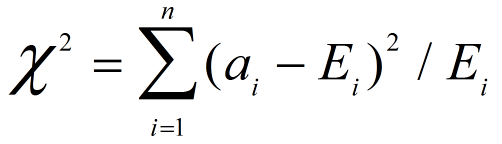

Outlier (离群点)
==============================================================================
在特征工程中, 我们往往要剔除离群点. 为了剔除离群点, 我们首先要检测出哪些是离群点, 下面列出了一些离群点检测(Outlier detection)的方法.

Gaussian Distribution (一元离群点检测)
------------------------------------------------------------------------------
- 适用: 连续变量

多元高斯离群点检测
------------------------------------------------------------------------------
- 适用: 连续变量

Distance Based
------------------------------------------------------------------------------
- 适用: 连续变量

Chi-Square Detection (卡方统计量检测)
------------------------------------------------------------------------------
- 适用: 连续变量

其中, ai是a在第i维上的取值, Ei是所有样本在第i维的均值, n是维度. 如果对象a的卡方统计量很大, 那么该对象就可以认为是离群点.

iForest (Isolation Forest) 孤立森林异常检测
------------------------------------------------------------------------------
- 适用: 连续和离散