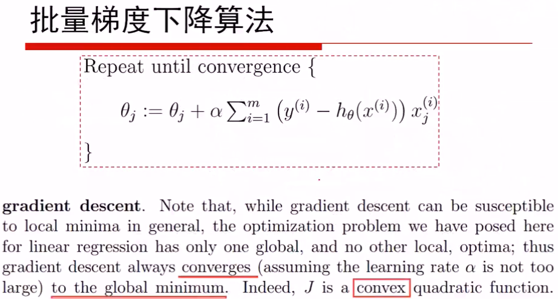
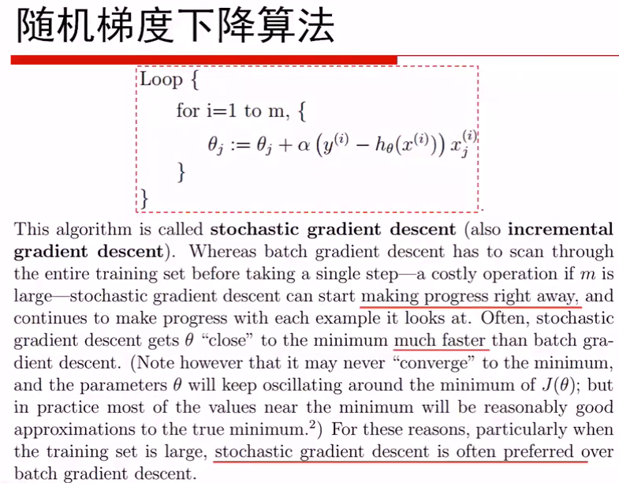

Regression (回归)
==============================================================================
线性回归的概念

线性回归的损失函数的推导:

使用极大似然估计(maxlikelyhood)来解释最小二乘:

中心极限定理: 实际问题中, 很多随机现象可以看成众多因素的独立影像的综合反映, 往往这个总的随机变量服从近似正态分布.

用正则化解决Overfitting
------------------------------------------------------------------------------
- L2 Normal: Ridge
- L1 Normal: Lasso
- Combination: Elastic Net

注: 正则项前往往有一个乘项系数, 用来决定正则化的力度.

梯度下降法 (Gradient Descent)
------------------------------------------------------------------------------
在求解目标函数的最小值时, 我们往往采用梯度下降算法来对最优解进行数值逼近, 从而避免了解析式求解.

普通梯度下降
~~~~~~~~~~~~~~~~~~~~~~~~~~~~~~~~~~~~~~~~~~~~~~~~~~~~~~~~~~~~~~~~~~~~~~~~~~~~~~

批量梯度下降 (Batch GD)
~~~~~~~~~~~~~~~~~~~~~~~~~~~~~~~~~~~~~~~~~~~~~~~~~~~~~~~~~~~~~~~~~~~~~~~~~~~~~~

将所有的样本放在一起, 一次性计算最小值. 并且这个函数是一个凸函数, 所以一定存在全局最优解.

随机梯度下降 (Stochastic GD)
~~~~~~~~~~~~~~~~~~~~~~~~~~~~~~~~~~~~~~~~~~~~~~~~~~~~~~~~~~~~~~~~~~~~~~~~~~~~~~

每来一个样本, 我们就进行一次迭代求最优.

注: 跟直觉不同, 实际上随机梯度下降往往效果要好于批量梯度下降.

批量随机梯度下降 (Mini Batch GD)
~~~~~~~~~~~~~~~~~~~~~~~~~~~~~~~~~~~~~~~~~~~~~~~~~~~~~~~~~~~~~~~~~~~~~~~~~~~~~~
.. image:: MiniBatch.png

过拟合
------------------------------------------------------------------------------
在线性回归中, 过拟合现象表现于, 回归方程在训练数据集上的误差很小, 但是在用于预测和测试数据集上误差很大.

举个例子, 我们用 ``y = f(x)`` 进行多项式拟合. 数学上可以证明, 如果我们有n个数据点, 我们有且只有一个n-1次的多项式方程能通过所有的这些点. 这个拟合在训练数据集上堪称完美, 但是用这个模型进行预测, 效果肯定极差.

为什么呢? 如果你观察这个高阶多项式方程, 可以发现他们有些项, **特别是高阶项的系数, 会非常大**. 虽然这些项在训练集上加加减减之后数值比较稳定. 但是一旦x变大之后, 这些系数很大的高阶项会随着指数效应, 产生非常大的值. 使得模型不可用.

**解决思路**:

为了防止过拟合, 我们希望这些系数不要太大. 那么我们可以在损失函数(Cost Function)中加入正则项(Normalization). 正则项即是所有这些系数的范式, 通常使用二范式(L2-Norm, Ridge), 和一范式(L1-Norm Lasso)

Lasso和Ridge的比较
~~~~~~~~~~~~~~~~~~~~~~~~~~~~~~~~~~~~~~~~~~~~~~~~~~~~~~~~~~~~~~~~~~~~~~~~~~~~~~
解析解:

- L1: 无解析解(Analytical solutions), 只有数值解(Numerical solution).
- L2: 有解析解.

特征选择:

- L1: 可以用来做特征选择(Variable select), 因为在L1的解中可以使得某些变量的系数变为0. 因为如果一个模型中某些变量的系数是0, 那么其实就是说明变量不重要.
- L2: 不能用来做特征选择, 无法shrink parameters to 0.

为什么不用0.5正则?
~~~~~~~~~~~~~~~~~~~~~~~~~~~~~~~~~~~~~~~~~~~~~~~~~~~~~~~~~~~~~~~~~~~~~~~~~~~~~~
因为:

如果小于Norm1正则, 则目标函数就不是凸函数(Non Convex), 那么就无法使用凸优化(Convex Optimization)进行数值求解了.

当加了正则项之后, 损失函数所能取到的最小值已经没有无正则项时小了.

L2正则

线性回归对

调参
------------------------------------------------------------------------------
