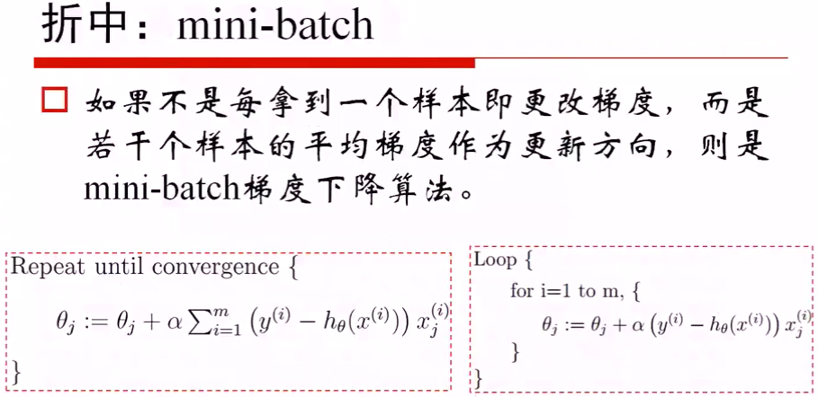

Regression (回归)
==============================================================================
线性回归的概念

线性回归的损失函数的推导:

使用极大似然估计(maxlikelyhood)来解释最小二乘:

中心极限定理: 实际问题中, 很多随机现象可以看成众多因素的独立影像的综合反映, 往往这个总的随机变量服从近似正态分布.

用正则化解决Overfitting
------------------------------------------------------------------------------
- L2 Normal: Ridge
- L1 Normal: Lasso
- Combination: Elastic Net

注: 正则项前往往有一个乘项系数, 用来决定正则化的力度.

梯度下降法 (Gradient Descent)
------------------------------------------------------------------------------
在求解目标函数的最小值时, 我们往往采用梯度下降算法来对最优解进行数值逼近, 从而避免了解析式求解.

普通梯度下降
~~~~~~~~~~~~~~~~~~~~~~~~~~~~~~~~~~~~~~~~~~~~~~~~~~~~~~~~~~~~~~~~~~~~~~~~~~~~~~

批量梯度下降 (Batch GD)
~~~~~~~~~~~~~~~~~~~~~~~~~~~~~~~~~~~~~~~~~~~~~~~~~~~~~~~~~~~~~~~~~~~~~~~~~~~~~~

将所有的样本放在一起, 一次性计算最小值. 并且这个函数是一个凸函数, 所以一定存在全局最优解.

随机梯度下降 (Stochastic GD)
~~~~~~~~~~~~~~~~~~~~~~~~~~~~~~~~~~~~~~~~~~~~~~~~~~~~~~~~~~~~~~~~~~~~~~~~~~~~~~

.. image:: 随机梯度下降.png

每来一个样本, 我们就进行一次迭代求最优.

注: 跟直觉不同, 实际上随机梯度下降往往效果要好于批量梯度下降.

批量随机梯度下降 (Mini Batch GD)
~~~~~~~~~~~~~~~~~~~~~~~~~~~~~~~~~~~~~~~~~~~~~~~~~~~~~~~~~~~~~~~~~~~~~~~~~~~~~~

small business card,

model

- pay us back
- use more transaction data

third party,
software
