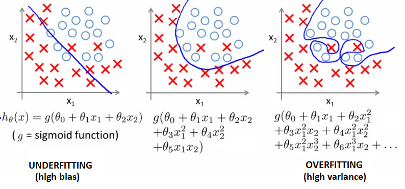

.. _overfitting:

过拟合问题
==============================================================================
过拟合是指的, 在机器学习训练过程中, 模型为训练集过于量身定做了. 举个例子:

过拟合的典型特征是: 参数系数过多. 例如:

- 在回归问题中, 上图就是一个典型例子, 过多的二项式系数, 使得曲线过于曲折.
- 在决策树分类中, 过多的枝定义了太多的规则.

解决过拟合的常用方法是在代价函数中加入一个正则项, 这个正则项通常是L1, L2, L3的范式.

**为什么加入一个正则项(范式)能解决过拟合问题?**

先来看一下L123范式的定义:

假设损失函数为: f(x) = w0 + w1 * x1 + w2 * x2

- L1: w0, w1, w2 中正数的个数
- L2: |w0| + |w1| + |w2|
- L3: (w0 ** 2 + w1 ** 2 + w2 ** 2) ** 0.5

最终的损失函数为: f(x) = w0 + w1 * x1 + w2 * x2 + L1 or L2 or L3

这样的调整能使得最优解的系数尽可能小的特性, 从而避免过拟合.